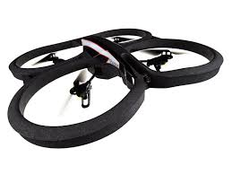

## Project Overview
The **Quadcopter** or **Quadrotor Helicopter** is becoming an increasingly popular aircraft for both personal and professional use. Its maneuverability lends itself to many applications, from last-mile delivery to cinematography, from acrobatics to search-and-rescue.

Most quadcopters have 4 motors to provide thrust, although some other models with 6 or 8 motors are also sometimes referred to as quadcopters. Multiple points of thrust with the center of gravity in the middle improves stability and enables a variety of flying behaviors.

But it also comes at a price–the high complexity of controlling such an aircraft makes it almost impossible to manually control each individual motor's thrust. So, most commercial quadcopters try to simplify the flying controls by accepting a single thrust magnitude and yaw/pitch/roll controls, making it much more intuitive and fun.

The next step in this evolution is to enable quadcopters to autonomously achieve desired control behaviors such as takeoff and landing. You could design these controls with a classic approach (say, by implementing PID controllers). Or, you can use reinforcement learning to build agents that can learn these behaviors on their own. This is what you are going to do in this project!

## Project Instructions
In this project, you will design an agent that can fly a quadcopter, and then train it using a reinforcement learning algorithm of your choice! Try to apply the techniques you have learnt in this module to find out what works best, but also feel free to come up with innovative ideas and test them.

You are encouraged to use the workspace in the next concept to complete the project. Alternatively, you can clone the project from the [GitHub repository](https://github.com/udacity/RL-Quadcopter-2).

Submit your project for review once you meet the project specifications as per this [rubric](https://review.udacity.com/#!/rubrics/1189/view).
